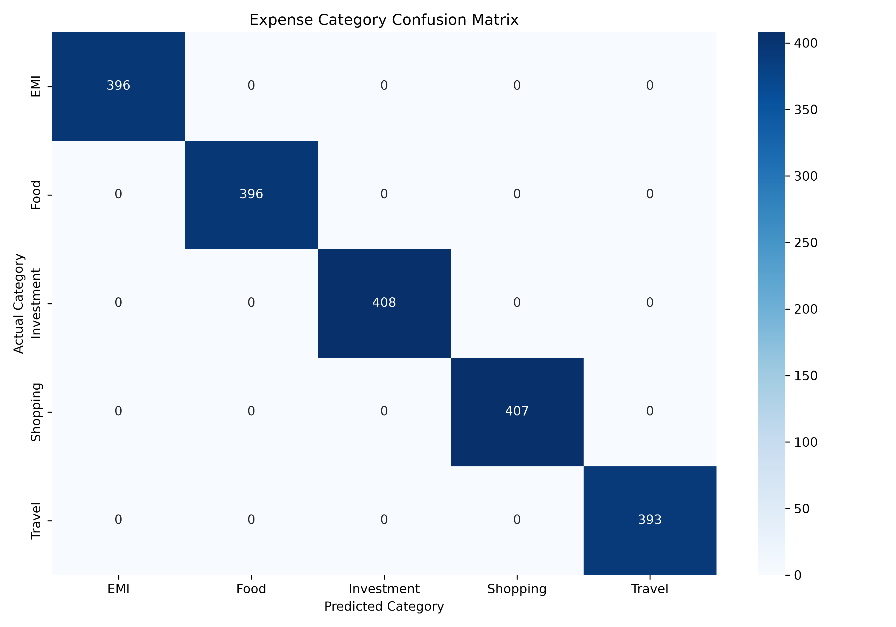
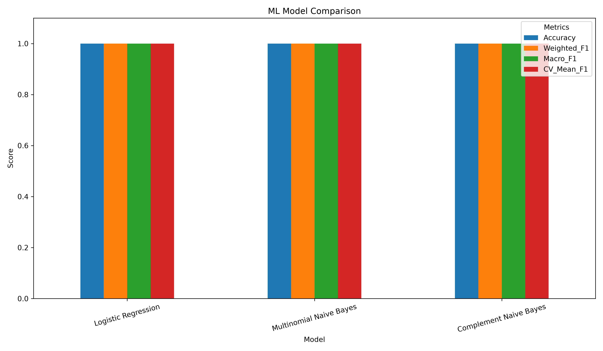

# 💰 Smart Expense ML

An end-to-end Machine Learning project that automatically categorizes expense descriptions into meaningful financial categories.

The project uses Natural Language Processing (NLP), TF-IDF vectorization, and multiple classification algorithms to predict expense categories.

---

## 🚀 Live Demo

🔗 **Streamlit App:**  
https://smart-expense-ml.streamlit.app

🔗 **GitHub Repository:**  
https://github.com/aniket-1312/smart-expense-ml

---

## 📌 Project Overview

Managing expenses manually can be time-consuming.

This project automatically predicts the category of an expense from its description.

### Example

| Expense Description | Predicted Category |
|---|---|
| Swiggy dinner | Food |
| Uber cab payment | Travel |
| Amazon shopping | Shopping |
| Monthly loan installment | EMI |
| SIP investment | Investment |

---

## ✨ Features

- 🧠 Machine Learning-based expense classification
- 📝 Text preprocessing and cleaning
- 🔤 TF-IDF feature extraction
- 🤖 Multiple ML model comparison
- 📊 Accuracy, Precision, Recall, and F1-score evaluation
- 🔥 Confusion Matrix visualization
- 📈 Model comparison chart
- 💾 Saved trained model and vectorizer
- 🌐 Streamlit web application
- 📋 Expense history
- 🔍 Category filtering
- 📊 Expense dashboard

---

## 🛠️ Tech Stack

| Technology | Purpose |
|---|---|
| Python | Programming Language |
| Pandas | Data Processing |
| Scikit-learn | Machine Learning |
| TF-IDF | Text Feature Extraction |
| Joblib | Model Serialization |
| Matplotlib | Visualization |
| Seaborn | Confusion Matrix |
| Streamlit | Web Application |
| GitHub | Version Control |

---

## 🧠 Machine Learning Workflow

```text
Expense Description
        ↓
Data Cleaning
        ↓
Train / Test Split
        ↓
TF-IDF Vectorization
        ↓
Model Training
        ↓
Model Evaluation
        ↓
Best Model Selection
        ↓
Save Model
        ↓
Predict New Expenses
```

---

## 🤖 Models Used

1. Logistic Regression
2. Multinomial Naive Bayes
3. Complement Naive Bayes

---

## 📊 Model Performance

| Model | Accuracy | Weighted F1 | Macro F1 | CV Mean F1 |
|---|---:|---:|---:|---:|
| Logistic Regression | 100% | 100% | 100% | 100% |
| Multinomial Naive Bayes | 100% | 100% | 100% | 100% |
| Complement Naive Bayes | 100% | 100% | 100% | 100% |

> All three baseline models achieved perfect scores on the current evaluation dataset. Further testing on more varied, unseen real-world transactions is recommended.

---

## 📊 Evaluation Results

### Confusion Matrix



### Model Comparison



---

## 📂 Project Structure

```text
smart-expense-ml/
│
├── app.py
├── README.md
├── requirements.txt
├── .gitignore
│
├── data/
│   └── cleaned_expenses.csv
│
├── models/
│   ├── expense_model.pkl
│   ├── tfidf_vectorizer.pkl
│   └── model_comparison.csv
│
├── reports/
│   ├── confusion_matrix.png
│   └── model_comparison.png
│
└── src/
    ├── train_model.py
    ├── predict.py
    └── evaluate_model.py
```

---

## ⚙️ Installation

Clone the repository:

```bash
git clone https://github.com/aniket-1312/smart-expense-ml.git
```

Navigate into the project:

```bash
cd smart-expense-ml
```

Create virtual environment:

```bash
python -m venv .venv
```

Activate virtual environment:

### macOS / Linux

```bash
source .venv/bin/activate
```

### Windows

```bash
.venv\Scripts\activate
```

Install dependencies:

```bash
pip install -r requirements.txt
```

---

## ▶️ Run the Application

```bash
streamlit run app.py
```

---

## 🧪 Train the Model

```bash
python src/train_model.py
```

---

## 📈 Generate Evaluation Reports

```bash
python src/evaluate_model.py
```

---

## 🔮 Future Improvements

- Add more diverse real-world expense descriptions
- Support more expense categories
- Improve handling of ambiguous transactions
- Add monthly spending analytics
- Add budget recommendations
- Add multilingual expense classification
- Deploy the application publicly

---

## 👨‍💻 Author

**Aniket Chavda**

GitHub:  
https://github.com/aniket-1312

---

## ⭐ If you like this project

Give the repository a ⭐ on GitHub!